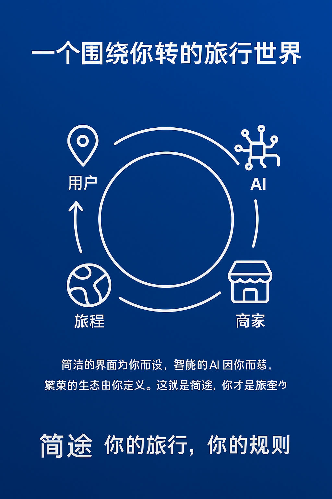

# 「简途」项目总体宣传方案

## 一、新闻稿：功能与理念的融合
**标题：** 简途上线：以“用户主导”为核，打造自由、智能、共生的旅行新生态

**副标题：** 【功能亮点】 地图自由标点、AI路径规划、个性化推荐、真实日记社区  【核心模式】 一切从用户出发，依靠用户反馈进化，最终回归用户价值

**[城市，年-月-日]** – 今日，旨在重新定义旅行规划的平台「简途」正式亮相。它不仅仅是一套工具的集合，更是一种以“用户主导”为根本准则的全新尝试。「简途」的所有功能设计与商业模式，都围绕一个核心展开：如何更好地服务于用户的个性化需求，并让用户成为平台进化的真正驱动力。

### 功能基石：赋予用户至高无上的规划自由

**地图自由标点：** 「简途」坚信，旅行的灵感不应被束缚。我们提供极致简洁的地图界面，允许用户像在画布上作画一样，随意标记任何感兴趣的地点。这确保了旅程的起点100%源于用户自身的兴趣与发现。

**AI智能路径规划：** 当用户完成灵感发散后，「简途」的AI助手将扮演忠诚的协作者角色。它能将用户散落的标记点，智能串联成一条时间合理、路线高效的可执行日程。AI的价值在于执行用户的意图，而非替代用户决策。

**个性化推荐系统：** 系统会根据用户的初始偏好与持续使用行为（如收藏、日记内容），不断学习优化推荐模型。这意味着，推荐列表会越来越精准，真正实现“千人千面”，让平台越来越懂每个独立的个体。

### 生态循环：用户的参与是平台活力的源泉

**真实日记社区：** 「简途」将景点与用户日记深度绑定。每一篇用户日记都是对景点的真实赋能，为后续旅行者提供最可靠的参考。这种“用户帮助用户”的模式，构建了平台最坚实的信任基石。

**商家入驻生态：** 平台的商业逻辑同样服务于用户。只有当聚集了大量高价值、有明确规划意愿的用户时，优质商家才会被吸引入驻。而商家的展示权重，则由其用户口碑（如日记好评）和与用户偏好的匹配度决定，从而迫使商家必须提供优质服务来赢得用户，形成一个良性循环。

### 理念宣言：我们只构建舞台，用户才是主角

“在「简途」的设计哲学中，用户不是流量，而是主人。”「简途」创始人阐述道，“简洁的界面是为了尊重用户的时间；强大的AI是为了解放用户的创造力；活跃的社区是为了放大用户声音；健康的商业是为了可持续地服务用户。这一切功能的终点，都是为了实现一个目标：构建一个真正由用户主导、因用户而繁荣的旅行生态。”

## 二、Q&A：功能实现与用户主导权的体现

**Q1: 「简途」的“地图自由标点”和“AI规划”如何体现“用户主导”？**

**A：** 这两项功能是“用户主导”的完美体现。“自由标点”赋予了用户创作的主动权，旅程的蓝图由用户亲手绘制。而“AI规划”则是在此基础上，提供高效的执行支持。它尊重用户的所有选择，并负责解决路径优化的繁琐问题。用户始终是旅程的“总设计师”，AI是得力的“助理规划师”。

**Q2: 平台如何利用我的数据？个性化推荐会不会让我陷入“信息茧房”？**

**A：** 我们对用户数据的利用遵循一个核心原则：一切为了优化您个人的体验。您的数据主要用于训练更懂您的私人AI助手。同时，我们的推荐系统平衡“精准投喂”和“探索发现”。在展示您可能喜欢的景点同时，也会基于热门日记等内容，为您推荐一些可能感兴趣的未知领域，鼓励探索的惊喜。

**Q3: 对于商家而言，在这个“用户主导”的平台上，成功的秘诀是什么？**

**A：** 秘诀从未如此简单直接：回归商业本质，尽全力服务好您的顾客。在这个平台上，任何营销技巧都比不上用户的一篇真实好评。您的成功取决于您能获得多少用户的真心认可。平台规则保障了优质服务者通吃的公平环境。

**Q4: 平台的盈利模式如何保证不损害用户体验？**

**A：** 我们的盈利来源于商家的年度入驻费。关键在于，我们的收入与用户体验强正相关。只有用户体验好，用户活跃度高，平台对商家才有吸引力，我们才能获得收入。因此，维护一个纯净、高效、以用户为中心的平台环境，是我们自身利益的最大化所在，这决定了我们会是用户体验最坚定的捍卫者。

